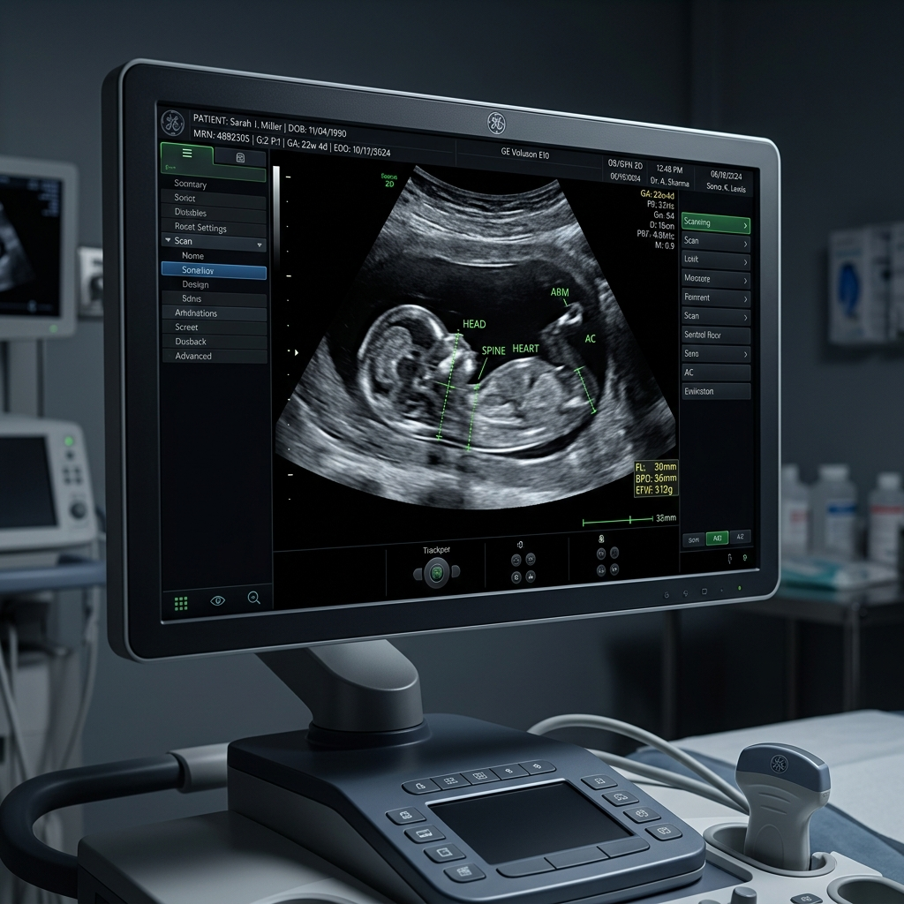

# Real-Time Sonography Assistant

Here are two cover image options. (Choose your preferred one and delete the other!)
**Clinical Monitor**


## Project Overview
This project is an advanced assistive tool designed for sonographers to perform **real-time standard anatomical plane detection**. Given a live video stream (such as a webcam standing in for an ultrasound probe, or a pre-recorded video file), the system continuously classifies each moment of the scan into one of **7 standard anatomical planes**, or *"Other"* (non-standard/transitional). 

### Key Features
- **Stable (Non-Flickering) On-Screen Label**: Temporal smoothing eliminates flickering.
- **Confidence Score**: Real-time probability readouts.
- **Visual Interpretability**: Throttled Grad-CAM style visual explanations highlighting the anatomical regions driving the classification.

---

## Target Classes
The model detects the following standard anatomical planes:
1. **Brain** — Trans-cerebellum
2. **Brain** — Trans-thalamic
3. **Brain** — Trans-ventricular
4. **Fetal Abdomen**
5. **Fetal Femur**
6. **Fetal Thorax**
7. **Maternal Cervix**
8. **Other** *(non-standard / transitional / off-plane)*

---

## Datasets Used
The models in this project are trained and evaluated using the following public datasets:
- **FETAL_PLANES_DB** *(Burgos-Artizzu et al., 2020)*: Used as the primary dataset for training, validation, and in-distribution testing across all 8 classes.
- **UCL/HC18 Cross-Device Benchmark**: A combination of the HC18 and UCL subsets used specifically as a held-out test set to measure cross-device and cross-site generalization.

---

## Architecture
The system is designed to run locally on consumer hardware (e.g., an RTX 4060 GPU) with extremely low perceived latency, rather than relying on a cloud backend. 

### Core Components
- **Backbone**: A lightweight CNN (e.g., RepVGG, EfficientNet, MobileNetV3) for fast feature extraction.
- **Classification Head**: A single 8-way softmax classifier processing features in a single forward pass.
- **Interpretability**: A throttled Grad-CAM module that provides visual explanations without severely impacting real-time throughput.
- **Temporal Stabilization**: A smoothing layer that uses confidence-weighted moving averages, hysteresis, and minimum dwell-times to stabilize the per-frame predictions and eliminate flickering.
- **Serving**: A local Python real-time loop utilizing OpenCV for video capture, preprocessing, inference, and overlay rendering.

### How It Works
1. **Video Capture**: A local thread captures frames from a webcam or a video file using OpenCV.
2. **Preprocessing**: Frames are resized, normalized, and converted into 3-channel tensors.
3. **Inference**: The CNN backbone and classification head process the frame, producing raw class probabilities. Periodically, Grad-CAM maps are generated.
4. **Temporal Smoothing**: Raw probabilities and class predictions are fed into a smoothing buffer to suppress spurious frame-level noise.
5. **UI Rendering**: The final stable prediction, confidence score, and Grad-CAM overlay are drawn onto the video frame and displayed to the user.

---

## Getting Started

### 1. Prerequisites
- **Hardware**: An NVIDIA GPU (e.g., RTX 4060) is highly recommended for real-time inference.
- **Drivers**: Update NVIDIA drivers to support CUDA 12.x.
- **Python**: Python 3.10 or 3.11.

### 2. Environment Setup
Create a Conda environment and install the required packages:

```bash
conda create -n ultrasound_env python=3.11 -y
conda activate ultrasound_env
pip install -r requirements.txt
```
*(Ensure that you install the version of PyTorch that matches your system's CUDA version. Check `requirements.txt` for dependencies.)*

### 3. Data Preparation
- Download the **FETAL_PLANES_DB** dataset and the **UCL/HC18** datasets.
- Place the raw datasets into `data/raw/`.
- Run the provided data pipeline scripts to build manifests, verify data, and generate train/validation/test splits:
  ```bash
  python scripts/build_manifest.py
  python scripts/patient_split.py
  python scripts/build_cross_device_manifest.py
  python scripts/run_sanity_checks.py
  ```

### 4. Training
To train the model from scratch on the processed dataset:
```bash
python src/train/train.py --config configs/convnext_tiny.yaml
```
*(You can use any of the provided per-backbone configuration files in the `configs/` directory.)*
> **Tip:** You can also run `python scripts/smoke_test.py` to verify the pipeline before starting full training.

### 5. Evaluation
To evaluate the trained model on the held-out test set:
```bash
python scripts/evaluate_cross_device.py --checkpoint checkpoints/convnext_tiny/best.pt
```

---

## Demo 1: Web UI
**Upload a Video, Watch it Get Labeled**

The web interface accepts an ultrasound video clip upload and returns a fully-annotated MP4 with per-frame plane labels, confidence scores, and Grad-CAM saliency overlays.

### Quick Start
**Install the two additional Demo 1 dependencies:**
```bash
pip install "gradio>=4.0,<5.0" "imageio[ffmpeg]"
```

**Launch the Gradio app:**
```bash
python app_gradio.py
# Opens http://127.0.0.1:7860 in your browser automatically
```

For a public shareable link (useful for remote demos):
```bash
python app_gradio.py --share
```

### How It Works
1. Upload any `.mp4` ultrasound clip via the browser interface.
2. Configure options (Grad-CAM, Tier-2a smoothing, HUD).
3. Click **▶ Process Video** — the render runs offline (not real-time).
4. The annotated output video plays inline in the browser. A per-frame label log (JSON) is also available for download.

### What is shown / not shown

| Feature | Demo 1 Status |
|---|---|
| Plane label (7 classes + Other) | Enabled (Every frame) |
| Confidence score | Enabled (Every frame) |
| STABLE / SETTLING badge | Enabled (Via Tier-1 + Tier-2a smoothing) |
| Grad-CAM overlay | Enabled (Configurable cadence, default: every frame) |
| Structure bounding boxes | **Not shown** (Detection model trained 1 epoch only) |
| Live webcam streaming | Not in Demo 1 (Upload only) |

> **Why no bounding boxes?** The multitask object detection model was trained for exactly 1 epoch as a wiring smoke-test (val macro-F1 0.8421, *below* the production classifier at 0.9183). Showing garbage boxes in a clinical context would be misleading. Boxes will appear in a future demo once the detection model is fully trained. This limitation is documented in `app_gradio.py` and `docs/demo1_walkthrough.md`.

### Known Accuracy Limitations
- **In-distribution test macro-F1: 0.8927** (patient-disjoint, held-out split).
- **Cross-device accuracy drop:** 98.0% (in-distribution) → 83.2% on HC18/UCL unseen devices. Expect similar degradation on hospital machines differing from the FETAL_PLANES_DB training sources.
- **`Brain_Trans_ventricular` is the weakest class** (F1 0.77) — well-documented in the literature as the hardest confusion case (vs. Trans-thalamic).

---

## 6. Real-Time Local Inference (Desktop App)
For local real-time inference with a GPU-equipped machine, the desktop app is available:
```bash
python -m src.realtime.app \
    --source data/processed/synthetic_clips/Brain_Trans_thalamic_clip01.mp4 \
    --loop

# Webcam (replace 0 with your device index)
python -m src.realtime.app --source 0
```

**Controls during playback:**
- `q` / `ESC`: Quit
- `g`: Toggle Grad-CAM
- `h`: Toggle HUD
- `space`: Pause

*Validated at **23.6–23.7 fps** stable on RTX 4060 over a 120-second run with no thermal throttling (see `logs/realtime/`).*
