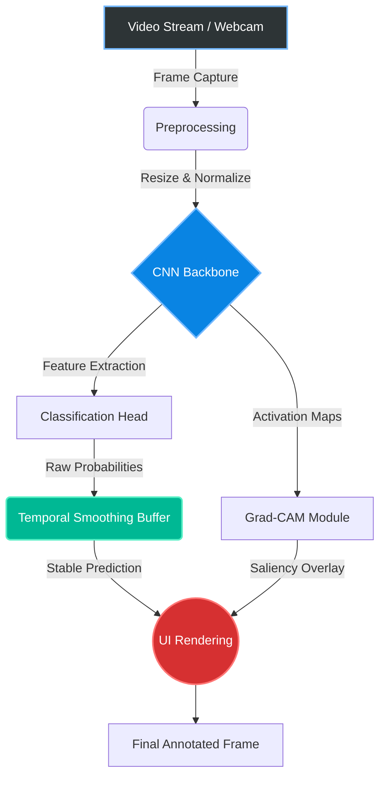

# FetScan — A Real-Time Sonography Assistant


## Project Overview
**FetScan** is an advanced assistive diagnostic tool designed for sonographers and maternal-fetal medicine specialists to perform **real-time standard anatomical plane detection**. Given a live video stream (such as a webcam standing in for an ultrasound probe, or a pre-recorded video file), the system continuously classifies each moment of the scan into one of **7 standard anatomical planes**, or *"Other"* (non-standard/transitional). This gives immediate, accurate feedback during critical diagnostic procedures.

### Key Features
**Stable (Non-Flickering) On-Screen Label**  
Our temporal smoothing algorithm acts like a shock absorber for predictions, eliminating visual noise and flickering to provide a crystal-clear, steady readout.

**Visual Interpretability & Confidence**  
Not only does the system provide a real-time probability score, but it also uses throttled Grad-CAM visual explanations. This highlights the exact anatomical regions driving the classification, giving you a transparent look into the AI's "brain".

<br clear="all" />

---

## Target Classes
The model detects the following standard anatomical planes:
1. **Brain** — Trans-cerebellum
2. **Brain** — Trans-thalamic
3. **Brain** — Trans-ventricular
4. **Fetal Abdomen**
5. **Fetal Femur**
6. **Fetal Thorax**
7. **Maternal Cervix**
8. **Other** *(non-standard / transitional / off-plane)*

---

## Datasets Used
The models in this project are trained and evaluated using the following public datasets:
- **FETAL_PLANES_DB** *(Burgos-Artizzu et al., 2020)*: Used as the primary dataset for training, validation, and in-distribution testing across all 8 classes.
- **UCL/HC18 Cross-Device Benchmark**: A combination of the HC18 and UCL subsets used specifically as a held-out test set to measure cross-device and cross-site generalization.

---

## Architecture
The system is designed to run locally on consumer hardware (e.g., an RTX 4060 GPU) with extremely low perceived latency, rather than relying on a cloud backend. 

### System Workflow



### Core Components
- **Backbone**: A lightweight CNN (e.g., RepVGG, EfficientNet, MobileNetV3) for blazing fast feature extraction.
- **Classification Head**: A single 8-way softmax classifier processing features in a single forward pass.
- **Interpretability**: A throttled Grad-CAM module that provides visual explanations without severely impacting real-time throughput.
- **Temporal Stabilization**: A smoothing layer that uses confidence-weighted moving averages, hysteresis, and minimum dwell-times.
- **Serving**: A local Python real-time loop utilizing OpenCV.

---

## Getting Started

### 1. Prerequisites
- **Hardware**: An NVIDIA GPU (e.g., RTX 4060) is highly recommended for real-time inference.
- **Drivers**: Update NVIDIA drivers to support CUDA 12.x.
- **Python**: Python 3.10 or 3.11.

### 2. Environment Setup
Create a Conda environment and install the required packages:

```bash
conda create -n ultrasound_env python=3.11 -y
conda activate ultrasound_env
pip install -r requirements.txt
```
*(Ensure that you install the version of PyTorch that matches your system's CUDA version.)*

### 3. Data Preparation
- Download the datasets and place them into `data/raw/`.
- Run the provided data pipeline scripts to build manifests, verify data, and generate splits:
  ```bash
  python scripts/build_manifest.py
  python scripts/patient_split.py
  python scripts/build_cross_device_manifest.py
  python scripts/run_sanity_checks.py
  ```

### 4. Training
To train the model from scratch on the processed dataset:
```bash
python src/train/train.py --config configs/convnext_tiny.yaml
```

### 5. Evaluation
To evaluate the trained model on the held-out test set:
```bash
python scripts/evaluate_cross_device.py --checkpoint checkpoints/convnext_tiny/best.pt
```

---

## Demo 1: FetScan Web UI

The web interface accepts an ultrasound video clip upload and returns a fully-annotated MP4 with per-frame plane labels, confidence scores, and optional Grad-CAM saliency overlays.

**Grad-CAM is OFF by default** — a sonographer has no use for saliency maps at runtime. Enable it in the sidebar (Streamlit) or options panel (Gradio) for model explanation or research use.

### Quick Start — Streamlit (primary interface)
```bash
conda run -n fetalplane streamlit run app_streamlit.py
# → http://localhost:8501
```

### Quick Start — Gradio (backup interface)
```bash
conda run -n fetalplane python app_gradio.py
# → http://127.0.0.1:7860
conda run -n fetalplane python app_gradio.py --share  # public tunnel
```

### What is shown / not shown

| Feature | Demo 1 Status |
|---|---|
| Plane label (7 classes + Other) | ✅ Every frame |
| Confidence score | ✅ Every frame |
| STABLE / SETTLING badge | ✅ Tier-1 + Tier-2a smoothing |
| Grad-CAM overlay | ✅ Available (OFF by default; enable in sidebar) |
| Structure bounding boxes | ❌ Not shown (detection model trained 1 epoch only) |

> **Why no bounding boxes?** The multitask object detection model was trained for exactly 1 epoch as a wiring smoke-test. Showing garbage boxes in a clinical context would be misleading.

### Known Accuracy Limitations
- **In-distribution test macro-F1: 0.8927** (patient-disjoint, held-out split).
- **Cross-device accuracy drop:** 98.0% (in-distribution) → 83.2% on HC18/UCL unseen devices.
- **`Brain_Trans_ventricular` is the weakest class** (F1 0.77) — well-documented in the literature as the hardest confusion case.

---

## 6. Real-Time Local Inference (Desktop App)
For local real-time inference with a GPU-equipped machine, the desktop app is available:
```bash
conda run -n fetalplane python -m src.realtime.app --source data/processed/synthetic_clips/multiplane_scan_01.mp4 --loop
 
or

conda run -n fetalplane python -m src.realtime.app `
    --source data/processed/synthetic_clips/multiplane_scan_01.mp4 `
    --loop


# Add --debug to enable Grad-CAM overlay (off by default = clinical mode)
conda run -n fetalplane python -m src.realtime.app --source data/processed/synthetic_clips/multiplane_scan_01.mp4 --loop --debug
```

**Controls during playback:**
- `q` / `ESC`: Quit
- `g`: Toggle Grad-CAM overlay
- `h`: Toggle HUD
- `space`: Pause

> **Grad-CAM is OFF by default** (clinical mode). Use `--debug` to enable it for model explanation or development runs. The `--no-gradcam` flag is a deprecated no-op (kept for backwards compatibility).

*Validated at **23.6–23.7 fps** stable on RTX 4060 over a 120-second run with no thermal throttling.*
